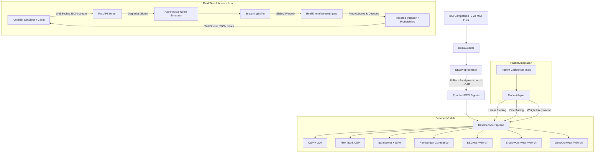

# Adaptive Neural Decoder for Cerebral Palsy (AND-CP)

An enterprise-grade, modular closed-loop brain-computer interface (BCI) decoding platform designed to ingest healthy motor imagery EEG recordings and adapt through transfer learning to contaminated, CP-like neural signals.

---

## 🏗️ System Architecture

