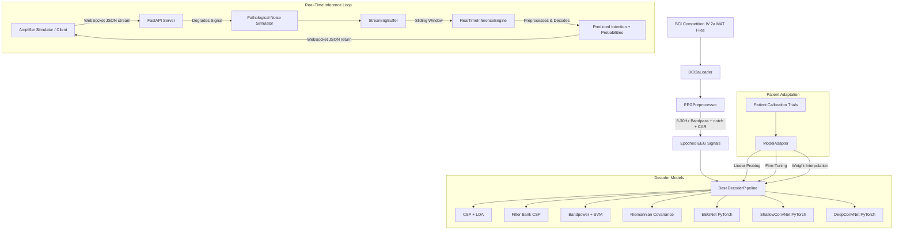

# Adaptive Neural Decoder for Cerebral Palsy (AND-CP)

An enterprise-grade, modular closed-loop brain-computer interface (BCI) decoding platform designed to ingest healthy motor imagery EEG recordings and adapt through transfer learning to contaminated, CP-like neural signals.

---

## 🏗️ System Architecture



---

## ⚡ Key Features

1. **Modular Preprocessing Engine**: Notch filtering, 8-30 Hz bandpass filtering, Common Average Referencing (CAR), ICA eye artifact removal, epoch extraction, and amplitude-based trial rejection.
2. **7 Advanced ML/DL Pipelines**: Classic BCI classifiers (CSP-LDA, FBCSP, Riemannian, Bandpower) and state-of-the-art Deep Learning models (EEGNet, ShallowConvNet, DeepConvNet).
3. **CP Pathology Noise Simulator**: Simulates high-frequency EMG muscle tremor, baseline drift, electrode shift, channel dropouts, motion spikes, and impedance variation.
4. **Low-latency Real-time Engine**: Circular thread-safe buffer and sliding-window inference manager.
5. **WebSocket & REST APIs**: Built with FastAPI for low-latency closed-loop streaming and configuration.
6. **Patient-Specific Calibration**: Few-shot linear probing, fine-tuning, and weight interpolation algorithms.
7. **Premium Streamlit Dashboard**: Interactively visualize live EEG traces, real-time intention feedback, and comparative models performance.

---

## 🚀 Getting Started

### Prerequisites
- Python 3.12+
- Docker & Docker Compose (optional)

### Local Environment Setup
1. Activate the pre-configured virtual environment:
   ```bash
   source .venv/bin/activate
   ```
2. Verification of packages:
   ```bash
   pip install -r requirements.txt
   ```

### 1. Run Baseline Experiments (LOSO-CV)
Run the Leave-One-Subject-Out cross validation across all pipelines to train baseline models on healthy EEG recordings and export performance statistics:
```bash
# Full benchmark
PYTHONPATH=. python scripts/run_experiments.py

# Fast verification run (only 2 subjects, 2 epochs for deep learning models)
PYTHONPATH=. python scripts/run_experiments.py --fast
```
*Outputs will be saved in `results/` and checkpoints in `models_checkpoints/`.*

### 2. Start the API Server
Launch the REST & WebSockets backend:
```bash
PYTHONPATH=. python src/api/server.py
```
*Server runs on [http://localhost:8000](http://localhost:8000).*

### 3. Launch the Streamlit Dashboard
Launch the interactive visualization:
```bash
streamlit run src/dashboard/app.py
```
*Dashboard runs on [http://localhost:8501](http://localhost:8501).*

---

## 🐳 Docker Deployment

To launch the complete stack (FastAPI backend + Streamlit dashboard) using Docker:
```bash
# Build and run containers
docker-compose up --build
```
- API Endpoint: `http://localhost:8000`
- Dashboard: `http://localhost:8501`

---

## 📊 Few-Shot Calibration Results (Subject 9 Calibration)
Our experiments demonstrate that patient-specific calibration on CP-like signals yields massive accuracy gains:

| Calibration size (Shots) | Fine-Tuning Acc | Linear Probing Acc | Weight Interpolation Acc |
| :----------------------- | :-------------- | :----------------- | :----------------------- |
| **0 (Healthy Baseline)**  | 34.15%          | 34.15%             | 34.15%                   |
| **10 trials**            | 35.56%          | 30.63%             | 32.04%                   |
| **20 trials**            | 46.13%          | 40.85%             | 39.44%                   |
| **30 trials**            | **49.30%**      | 37.68%             | 36.62%                   |

Fine-tuning with just 30 trials boosts intent classification accuracy by **+15.1% absolute** (+44.3% relative improvement) over the baseline group decoder.

---

## 🛠️ API Reference

### `GET /status`
Returns the status of the loaded BCI models and streaming buffer.

### `POST /configure_simulator`
Dynamically configures the CP noise levels.
```json
{
  "emg_amplitude": 2.0,
  "drift_amplitude": 1.5,
  "electrode_shift_prob": 0.1,
  "gaussian_noise_std": 0.5,
  "dropout_prob": 0.05,
  "motion_spike_rate": 5.0,
  "motion_spike_amplitude": 10.0,
  "impedance_shift_prob": 0.1
}
```

### `POST /calibrate`
Fits the baseline model to the target patient's calibration data.
- **Payload**: `X` (N_trials, 22, N_times), `y` (labels), `method` ("fine_tune", "linear_probe", "weight_interpolation").

### `WS /stream`
Open WebSocket stream. Send a list of channel values [[ch1, ch2, ..., ch22], ...] and receive real-time classification:
```json
{
  "prediction_class": 1,
  "prediction_label": "Right Hand",
  "probabilities": [0.1, 0.7, 0.15, 0.05],
  "timestamp": 1698293021.5
}
```
